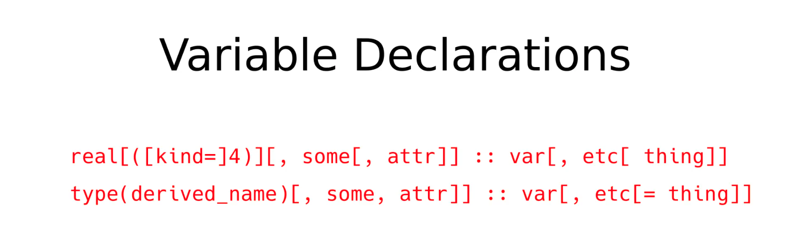
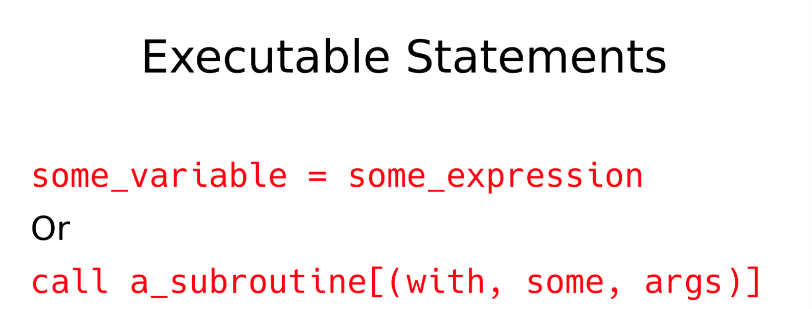

# General notes

- Fortran is *case insensitive*
- White spaces and indentation is insignificant to the compiler
- Comments are made with !
    - No block comments
    - Try to keep comments to one line max.

# Program declaration and end

- program name
    - name needs to start with alphabetical char.
- end [program [name]]
    - Just end is mandatory but if program name is used the names must match

# Implicit Statements

- Implicit statements declare default typing rules for variables that are not explicitly typed.
- By default (without implicit none), variables starting with letters I–N are of type INTEGER, while all others (A–H, O–Z) are REAL.
- The statement implicit none disables this behavior and requires explicit typing of all variables.
- Using implicit none is considered best practice because it avoids hard-to-detect errors due to undeclared or misspelled variables.
- Implicit rules can also be customized with statements like `implicit integer (A–C, X, Z)` or `implicit integer 'i-i'`, assigning specific types to variable name ranges.
- Only one implicit statement is allowed per program unit (program, module, function, or subroutine).
- Scope: an implicit statement affects only the program unit where it appears.

# Variable Declarations
- For consistency sake, try to always use `::` even if they are not mandatory in certain cases
- You can declare multiple variables of the same type separating them by commas

- First way is for primitive types
- Second way is for derived types

# Executable Statements
